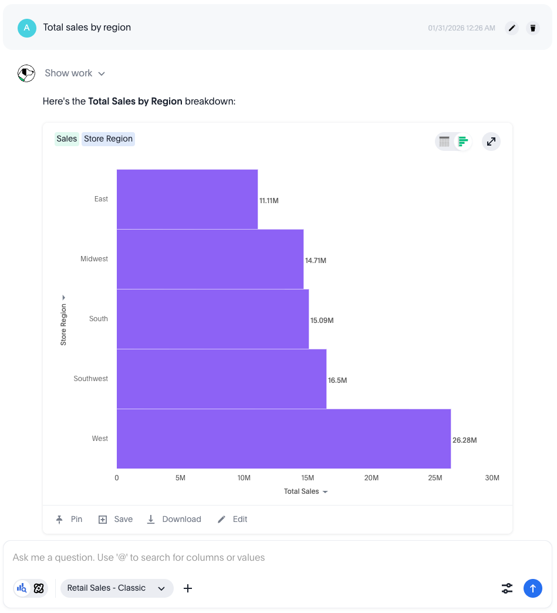

= Hardware and Software Requirements
Author Name
:idprefix:
:idseparator: -
:!example-caption:
:!table-caption:
:page-layout: home-branch-cloud
//:page-role: -toc
:page-pagination:
:description: A "preview" site for the new UI.

[.lead]
This is it!

.ThoughtSpot Sage removal in 26.6.0.cl
[.announce-box]
--
ThoughtSpot Sage is deprecated and has reached end-of-life. It is removed from ThoughtSpot in this release.

All clusters currently on Sage have been automatically upgraded to Spotter 2. Your AI usage preferences — including whether AI answer generation is enabled or disabled will be retained as part of the migration. We recommend all administrators migrate to Spotter as soon as possible.

For customers using the ThoughtSpot Embed SDK, ensure your SDK is updated to the latest version before upgrading to 26.6.0.cl. Refer to Deprecated and removed features for details.
--

xref:home.adoc[]

[.card-gradient-box]
====
[discrete]
== Spotter agents

Automate key parts of your analytics workflow—from exploring and analyzing data to building visualizations and modeling your data. Each Spotter agent is built for a specific task, so you can move faster from question to insight without manual steps slowing you down.

[.card-link-grid-4]
****
[.card-link]
--
image::Spot.svg[Icon,36,36]

xref:Spotter.adoc[Spotter]

Discover insights from your data, just by asking.
--

[.card-link]
--
image::Lumos.svg[Icon,36,36]
xref:page.adoc[SpotterModel]

Turn raw data into models in minutes.
--

[.card-link]
--
image::##Kaios.svg##[Icon,36,36]

xref:page.adoc[SpotterViz]

Plan your story and build a Liveboard automatically.
--

[.card-link-ext]
--
image::Camo.svg[Icon,36,36]

xref:page.adoc[SpotterCode]

Build with AI-assisted +
coding in your IDE.
--
****
====

SPOTTER: Spotter 3 is now GA!

[.card-link]
--
link:/path/to/page[Responses API]

Build with the most powerful API for AI agents.

*Click here*
--

[.card-link]
--
link:/path/to/page[Spotter API]

Build with the most powerful AI agent.

*Click here*
--

[.card-box]
--
*Title text*

Description text here.
--

TIP: Use ==== for cards inside the grid, and -- for standalone cards

[.card-grid]
--
[.card-box]
====
*Card 1*

Description for card 1.Description for card 1.Description for card 1.Description for card 1.Description for card 1.Description for card 1.
====

[.card-box]
====
*Card 2*

Description for card 2.
====

[.card-box]
====
*Card 3*

Description for card 3.
====

[.card-box]
====
*Card 4*

Description for card 4.
====
--

[.card-grid]
--
[.card-box]
====
image::persona-business-user.png[Icon,40,40]
*Business User*

* xref:safelisting-our-ip-address.adoc[Safelist our IP address]
* xref:local-database.adoc[Connect to a local database]
* xref:public-blocks.adoc[Share blocks]
* xref:granting-access-via-service-account.adoc[Grant access via Service account]
====

[.card-box]
====
image::persona-analyst.png[Icon,40,40]
*Analyst*

* xref:snippets.adoc[Snippets]
* xref:local-database.adoc[Connect to a local database]
* xref:sqlite.adoc[SQLite]
* xref:stories.adoc[Stories]
* xref:triggers.adoc[Triggers]
* xref:dashboards.adoc[Dashboards]
* xref:forms.adoc[Forms]
* xref:tables.adoc[Tables]
* xref:pivot-tables.adoc[Pivot tables]
====

[.card-box]
====
image::persona-data-engineer.png[Icon,40,40]
*Data Engineer*

* xref:database-source.adoc[Add a new SQL database]
* xref:airtable.adoc[Airtable]
* xref:bigquery.adoc[BigQuery]
* xref:microsoft-sql-server-ms-sql.adoc[Microsoft SQL Server (MS SQL)]
* xref:connecting-to-panoply.adoc[Panoply]
* xref:connect-to-snowflake.adoc[Snowflake]
* xref:query-sheets-using-sql.adoc[Query Sheets using SQL]
* xref:query-blocks.adoc[Query blocks]
* xref:query-a-csv.adoc[Query a CSV]
* xref:excel-source.adoc[Excel]
* xref:salesforce-source.adoc[Salesforce]
====

[.card-box]
====
image::persona-it-ops.png[Icon,40,40]
*IT and Operations*

* xref:google-sheets.adoc[Google Sheets]
* xref:excel.adoc[Excel]
* xref:slack.adoc[Slack alerts]
* xref:email.adoc[Email alerts]
* xref:blocks-as-a-destination.adoc[Blocks]
* xref:database-destination.adoc[Database]
* xref:intercom.adoc[Intercom]
* xref:salesforce.adoc[Salesforce]
* xref:hubspot.adoc[Hubspot]
* xref:zoho.adoc[Zoho]
* xref:enter-manually.adoc[Enter manually]
* xref:front.adoc[Front]
* xref:microsoft-teams.adoc[Microsoft Teams]
* xref:drift.adoc[Drift]
* xref:customerio.adoc[Customer.io]
* xref:active-campaign.adoc[Active Campaign]
* xref:facebook.adoc[Facebook]
* xref:close.adoc[Close]
====
--

#Last updated#: {page-last_updated}

ThoughtSpot Cloud™ is our hosted and managed Software as a Service (SaaS) offering. ThoughtSpot Cloud is available on xref:ts-cloud-requirements-support.adoc#aws[Amazon Web Services (AWS)] and xref:ts-cloud-requirements-support.adoc#gcp[Google Cloud Platform (GCP)]. Customers can choose the cloud and region where they would like their ThoughtSpot Cloud service deployed.

ThoughtSpot Cloud offers multiple advantages over deployment form factors that you have to manage and maintain within your own organization.

Find topics for the common types of ThoughtSpot users.

[tabs]
====
Tab A::
+
--
Content for tab A.
--

Tab B::
+
--
Content for tab B.
--
====

[tabs]
====
Tab A:: Contents of Tab A.

Tab B::
+
Contents of Tab B.

Tab C::
+
--
Contents of Tab C.

Contains more than one block.
--
====

[.card-link-grid]
****
[.card-link]
--
image::Spot.svg[Icon,36,36]

xref:Spotter.adoc[Spotter]

Learn how to deploy, coach and use Spotter.
--

[.card-link]
--

image::Lumos.svg[Icon,36,36]

link:page.html[SpotterModel]

Turn raw data into models in minutes.
--

[.card-link]
--

image::Kaios.svg[Icon,36,36]

link:page.html[SpotterViz]

Plan your story and build a Liveboard automatically.
--

[.card-link-ext]
--
image::Camo.svg[Icon,36,36]

xref:spotter.adoc[SpotterCode]

AI-assisted coding right in your IDE.
--

[.card-link]
--
[.light-only]
image::Spotter.svg[Icon,36,36]
[.dark-only]
image::Spotter_Dark.svg[Icon,36,36]

xref:spotter.adoc[Spotter]

Learn how to deploy, coach and use Spotter.
--
****

[discrete]
== New product icons

[.card-link-grid]
****
[.card-link]
--
image::Brix.svg[Icon,36,36]

xref:page.adoc[Brix]

Description text.
--

[.card-link]
--
image::Camo.svg[Icon,36,36]

xref:page.adoc[Camo]

Description text.
--

[.card-link]
--
image::Kaios.svg[Icon,36,36]

xref:page.adoc[Kaios]

Description text.
--

[.card-link]
--
image::Lumos.svg[Icon,36,36]

xref:page.adoc[Lumos]

Description text.
--

[.card-link]
--
image::Spot.svg[Icon,36,36]

xref:page.adoc[Spot]

Description text.
--
****

[.card-link-grid-2]
****
[.card-link]
--
xref:page.adoc[Card title]

Description text.
--

[.card-link]
--
xref:page.adoc[Card title]

Description text.
--
****

[.card-link-grid-2]
****
[.card-link]
--
xref:page.adoc[Card title]

Description text.
--

[.card-link]
--
xref:page.adoc[Card title]

Description text.
--
****

Click on this: 

[cols="5%,95%" stripes="even"]
|===
|Step |Description

|1
|Users connect to ThoughtSpot Cloud securely over HTTPS. No local installation.

|2
|Users interact with ThoughtSpot Cloud to view Liveboards, generate queries, and use Spotter.

|3
|Spotter creates prompts that are sent to LLMs for processing.

|4
|ThoughtSpot Cloud generates SQL that is securely sent to a customer’s cloud data warehouse (CDW).  Spotter 3's multi-step analytics creates additional LLM prompts, sending CDW query results to LLMs for analysis. Spotter 3 leverages LLM-created Python for advanced analysis, which is cached in Azure for 1 hour before deletion.

|5
|Customer CDW executes SQL and returns only results to ThoughtSpot Cloud.

|6
|ThoughtSpot Cloud renders the SQL results as HTML and sends it to the user.

|7
|Customer’s users receive reports and visualizations in the browser.

|X
|Daily ThoughtSpot Cloud backups are taken and encrypted using AES-256. Backups include Spotter chat history and insights, if enabled.

|C
|ThoughtSpot ensures high availability and security with proactive monitoring and monthly updates.
|===

.Optional Title
****
Sidebars are used to visually separate auxiliary bits of content
that supplement the main text.

TIP: They can contain any type of content.

.Source code block in a sidebar
[,js]
----
const { expect, expectCalledWith, heredoc } = require('../../../test/test-utils')
----
****

[sidebar]
Sidebars are used to visually separate auxiliary bits of content
that supplement the main text.

[.float-group]
--
image:multirepo-ssg.svg[Multirepo SSG,180,135,float=right,role=float-gap]
Platonem complectitur mediocritatem ea eos.
Ei nonumy deseruisse ius.
Mel id omnes verear.
Vis no velit audiam, sonet <<dependencies,praesent>> eum ne.
*Prompta eripuit* nec ad.
Integer diam enim, dignissim eget eros et, ultricies mattis odio.
--

Vestibulum consectetur nec urna a luctus.
Quisque pharetra tristique arcu fringilla dapibus.
https://example.org[Curabitur,role=unresolved] ut massa aliquam, cursus enim et, accumsan lectus.
Mauris eget leo nunc, nec tempus mi? Curabitur id nisl mi, ut vulputate urna.

== Cu solet

Nominavi luptatum eos, an vim hinc philosophia intellegebat.
Lorem pertinacia `expetenda` et nec, [.underline]#wisi# illud [.line-through]#sonet# qui ea.
H~2~0.
E = mc^2^.
*Alphabet* *алфавит* _алфавит_ *_алфавит_*.
Eum an doctus <<liber-recusabo,maiestatis efficiantur>>.
Eu mea inani iriure.footnote:[Quisque porta facilisis tortor, vitae bibendum velit fringilla vitae! Lorem ipsum dolor sit amet, consectetur adipiscing elit.]

== Administrator capabilities by edition

[cols="30%,10%,10%,10%,10%" stripes="even"]
|===
.^|Capability ^.^|Team ^.^|Essentials ^.^|Pro ^.^|Enterprise

|Org creation and management
^.^|
^.^|
^.^|
^.^|image:checkmark_black.svg[Yes,15]

|User management
^.^|{set:cellbgcolor:#FFFFF}image:checkmark_black.svg[Yes,15]
^.^|image:checkmark_black.svg[Yes,15]
^.^|image:checkmark_black.svg[Yes,15]
^.^|image:checkmark_black.svg[Yes,15]

|Group management
^.^|
^.^|image:checkmark_black.svg[Yes,15]
^.^|image:checkmark_black.svg[Yes,15]
^.^|image:checkmark_black.svg[Yes,15]

|Role management (RBAC)
^.^|
^.^|
^.^|image:checkmark_black.svg[Yes,15]
^.^|image:checkmark_black.svg[Yes,15]

|SAML authentication
^.^|
^.^|
^.^|image:checkmark_black.svg[Yes,15]
^.^|image:checkmark_black.svg[Yes,15]

|System Liveboards
^.^|image:checkmark_black.svg[Yes,15]
^.^|image:checkmark_black.svg[Yes,15]
^.^|image:checkmark_black.svg[Yes,15]
^.^|image:checkmark_black.svg[Yes,15]

|Developer privileges*
^.^|
^.^|
^.^|image:checkmark_black.svg[Yes,15] *#*
^.^|image:checkmark_black.svg[Yes,15]

|Style customization*
^.^|
^.^|
^.^|image:checkmark_black.svg[Yes,15]
^.^|image:checkmark_black.svg[Yes,15]
|===
+*+ _Requires license for ThoughtSpot Embedded or internal analytics add-on._

+#+ _Requires license for ThoughtSpot Embedded or internal analytics add-on. Not available for multi-tenant editions._

[,json]
----
{
  "name": "module-name",
  "version": "10.0.1",
  "description": "An example module to illustrate the usage of package.json",
  "author": "Author Name <author@example.com>",
  "scripts": {
    "test": "mocha",
    "lint": "eslint"
  }
}
----

.Example paragraph syntax
[,asciidoc]
----
.Optional title
[example]
This is an example paragraph.
----

.Optional title
[example]
This is an example paragraph.

.Summary *Spoiler Alert!*
[%collapsible]
====
Details.

Loads of details.
====

[,asciidoc]
----
Voila!
----

.Result
[%collapsible.result]
====
Voila!
====

kbd:[Ctrl+F]

menu:File[Save]

WARNING: Watch out! you may fall into a deep dark hole, if you're not more careful! Don't blame me if something bad happens when i told you not to do it in the first place!

NOTE: don't forget! Otherwise, you'll be sorry!

TIP: Here's an idea!

CAUTION: Whatever you do, don't do this!

IMPORTANT: Don't forget this step!

SPOTTER: New Spotter feature!! SpotterModel 2.0!!!

== Frequently asked questions

The are some of the most commonly asked questions.
[.faq]
--
Where can I buy ThoughtSpot?::
You can purchase ThoughtSpot directly from our website or through an authorized reseller.

Can I try ThoughtSpot before I buy?::
Yes, ThoughtSpot offers a free trial for 30 days, no credit card required.

Can I buy ThoughtSpot before I try?::
Yes, ThoughtSpot offers a free trial for 30 days, no credit card required.
--

=== Steps

. do this.
. then, do this.
+
Make sure to remember this.
. then, do this.
+
Also, don't forget this!
or this.
+
or this.
. then, do this.
+
And, NEVER forget this!
. and finally, do this!

=== Some Code

How about some code?

[,js]
----
vfs
  .src('js/vendor/*.js', { cwd: 'src', cwdbase: true, read: false })
  .pipe(tap((file) => { // <.>
    file.contents = browserify(file.relative, { basedir: 'src', detectGlobals: false }).bundle()
  }))
  .pipe(buffer()) // <.>
  .pipe(uglify())
  .pipe(gulp.dest('build'))
----
<.> The `tap` function is used to wiretap the data in the pipe.
<.> Wrap each streaming file in a buffer so the files can be processed by uglify.
Uglify can only work with buffers, not streams.

Here's the same code with the `wrap` role added, which enables pre-wrap, if that's your speed.

[.wrap,js]
----
vfs
  .src('js/vendor/*.js', { cwd: 'src', cwdbase: true, read: false })
  .pipe(tap((file) => {
    file.contents = browserify(file.relative, { basedir: 'src', detectGlobals: false }).bundle()
  }))
  .pipe(buffer())
  .pipe(uglify())
  .pipe(gulp.dest('build'))
----

Execute these commands to validate and build your site:

 $ podman run -v $PWD:/antora:Z --rm -t antora/antora \
   version
 3.0.0
 $ podman run -v $PWD:/antora:Z --rm -it antora/antora \
   --clean \
   antora-playbook.yml

Cum dicat #putant# ne.
Est in <<inline,reque>> homero principes, meis deleniti mediocrem ad has.
Altera atomorum his ex, has cu elitr melius propriae.
Eos suscipit scaevola at.

....
pom.xml
src/
  main/
    java/
      HelloWorld.java
  test/
    java/
      HelloWorldTest.java
....

Eu mea munere vituperata constituam.

[%autowidth]
|===
|Input | Output | Example

m|"foo\nbar"
l|foo
bar
a|
[,ruby]
----
puts "foo\nbar"
----
|===

Here we just have some plain text.

[source]
----
plain text
----

[.rolename]
=== Liber recusabo

Select menu:File[Open Project] to open the project in your IDE.
Per ea btn:[Cancel] inimicus.
Ferri kbd:[F11] tacimates constituam sed ex, eu mea munere vituperata kbd:[Ctrl,T] constituam.

.Sidebar Title
****
Platonem complectitur mediocritatem ea eos.
Ei nonumy deseruisse ius.
Mel id omnes verear.

Altera atomorum his ex, has cu elitr melius propriae.
Eos suscipit scaevola at.
****

No sea, at invenire voluptaria mnesarchum has.
Ex nam suas nemore dignissim, vel apeirian democritum et.
At ornatus splendide sed, phaedrum omittantur usu an, vix an noster voluptatibus.

---

.Ordered list with customized numeration
[upperalpha]
. potenti donec cubilia tincidunt
. etiam pulvinar inceptos velit quisque aptent himenaeos
. lacus volutpat semper porttitor aliquet ornare primis nulla enim

Natum facilisis theophrastus an duo.
No sea, at invenire voluptaria mnesarchum has.

.Unordered list with customized marker
[square]
* ultricies sociosqu tristique integer
* lacus volutpat semper porttitor aliquet ornare primis nulla enim
* etiam pulvinar inceptos velit quisque aptent himenaeos

Eu sed antiopam gloriatur.
Ea mea agam graeci philosophia.

[circle]
* circles
** circles
*** and more circles!

At ornatus splendide sed, phaedrum omittantur usu an, vix an noster voluptatibus.

* [ ] todo
* [x] done!

Vis veri graeci legimus ad.

sed::
splendide sed

mea::
tad::
agam graeci

Let's look at that another way.

[horizontal]
sed::
splendide sed

mea::
agam graeci

At ornatus splendide sed.

.Library dependencies
[#dependencies%autowidth%footer,stripes=hover]
|===
|Library |Version

|eslint
|^1.7.3

|eslint-config-gulp
|^2.0.0

|expect
|^1.20.2

|istanbul
|^0.4.3

|istanbul-coveralls
|^1.0.3

|jscs
|^2.3.5

h|Total
|6
|===

Cum dicat putant ne.
Est in reque homero principes, meis deleniti mediocrem ad has.
Altera atomorum his ex, has cu elitr melius propriae.
Eos suscipit scaevola at.

[TIP]
This oughta do it!

Cum dicat putant ne.
Est in reque homero principes, meis deleniti mediocrem ad has.
Altera atomorum his ex, has cu elitr melius propriae.
Eos suscipit scaevola at.

[NOTE]
====
You've been down _this_ road before.
====

Cum dicat putant ne.
Est in reque homero principes, meis deleniti mediocrem ad has.
Altera atomorum his ex, has cu elitr melius propriae.
Eos suscipit scaevola at.

[WARNING]
====
Watch out!
====

[CAUTION]
====
[#inline]#I wouldn't try that if I were you.#
====

[IMPORTANT]
====
Don't forget this step!
====

.Key Points to Remember
[TIP]
====
If you installed the CLI and the default site generator globally, you can upgrade both of them with the same command.

 $ npm i -g @antora/cli @antora/site-generator

Or you can install the metapackage to upgrade both packages at once.

[subs=+quotes]
 $ npm i -g *antora*
====

Nominavi luptatum eos, an vim hinc philosophia intellegebat.
Eu mea inani iriure.

[discrete]
== Voluptua singulis

[discrete]
=== Nominavi luptatum

Cum dicat putant ne.
Est in reque homero principes, meis deleniti mediocrem ad has.
Ex nam suas nemore dignissim, vel apeirian democritum et.

.Antora is a multi-repo documentation site generator
image::multirepo-ssg.svg[Multirepo SSG,3000,opts=interactive]

.Let's see that again, but a little smaller
image::multirepo-ssg.svg[Multirepo SSG,300,role=text-left]

Make the switch today!

.Full Circle with Jake Blauvelt
video::300817511[vimeo,640,360,align=left]

.Naturally with Jake Blauvelt
video::fUvDykQUgMk[youtube,640,360,align=center]

[#english+中文]
== English + 中文

Altera atomorum his ex, has cu elitr melius propriae.
Eos suscipit scaevola at.

[,'Famous Person. Cum dicat putant ne.','Cum dicat putant ne. https://example.com[Famous Person Website]']
____
Lorem ipsum dolor sit amet, consectetur adipiscing elit.
Mauris eget leo nunc, nec tempus mi? Curabitur id nisl mi, ut vulputate urna.
Quisque porta facilisis tortor, vitae bibendum velit fringilla vitae!
Lorem ipsum dolor sit amet, consectetur adipiscing elit.
Mauris eget leo nunc, nec tempus mi? Curabitur id nisl mi, ut vulputate urna.
Quisque porta facilisis tortor, vitae bibendum velit fringilla vitae!
____

Lorem ipsum dolor sit amet, consectetur adipiscing elit.

[verse]
____
The fog comes
on little cat feet.
____

== Questions? Answers.

[.faq]
--
Where can I buy ThoughtSpot?::
You can purchase ThoughtSpot directly from our website or through an authorized reseller. Contact our sales team for pricing and licensing options.

Can I try ThoughtSpot before I buy?::
Yes, ThoughtSpot offers a free trial. Sign up on our website to get started with full access to the platform for 30 days, no credit card required.

What cloud platforms does ThoughtSpot support?::
ThoughtSpot Cloud is available on Amazon Web Services (AWS) and Google Cloud Platform (GCP). You can choose the cloud and region that best suits your needs.

How does ThoughtSpot keep my data secure?::
ThoughtSpot uses industry-standard AES-256 encryption for data at rest and TLS for data in transit. All backups are encrypted and access is controlled through role-based permissions.

What support options are available?::
ThoughtSpot offers multiple support tiers, including community forums, email support, and dedicated enterprise support with SLAs. All plans include access to our documentation and learning resources.
--

== Fin

That's all, folks!
